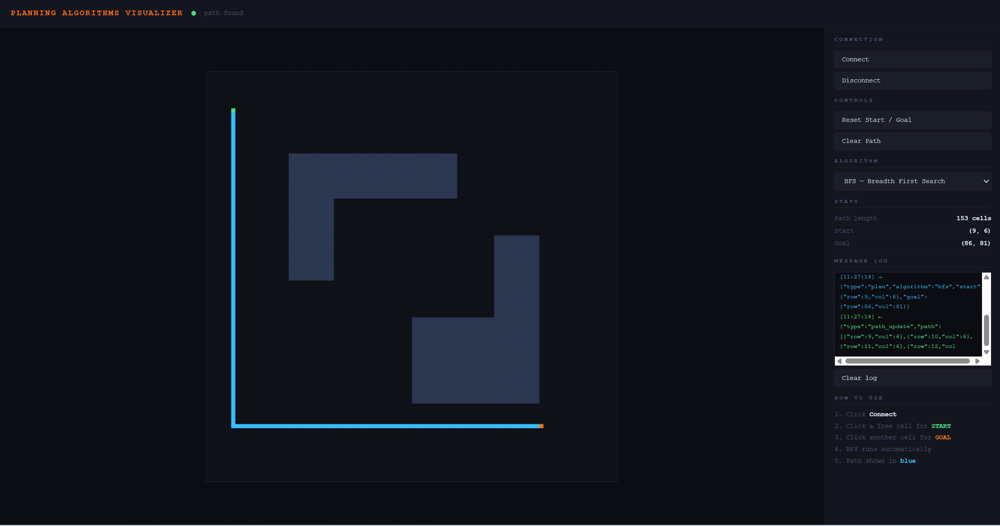

# Planning Algorithms Visualizer

<!-- One-sentence hook: what is this and why does it exist.
     e.g. "Interactive C++ path-planning visualizer — algorithms run
     in a C++ backend and stream live to a browser over WebSocket." -->

## Architecture

<!-- 3-4 sentences: C++ planner core, Crow WebSocket server,
     HTML5 Canvas frontend. Why this design? (planner knows nothing
     about the server, browser knows nothing about algorithms —
     clean separation). A simple ASCII diagram works great here. -->

## Implemented Algorithms

| Algorithm | Type | Optimal? | Notes |
|-----------|------|----------|-------|
| BFS       | ...  | ...      | ...   |
| DFS       | ...  | ...      | ...   |

<!-- Fill in. Add rows as you implement Dijkstra, A*, etc. -->

## Build & Run

<!-- Exact commands, copy-pasteable:
     dependencies (apt install line), cmake configure, build,
     run, open localhost:8080. Test it on a fresh clone mentally —
     would a stranger get it running? -->

## How to Use

<!-- Connect → click start → click goal → path appears.
     Mention the algorithm dropdown. -->

## Roadmap

<!-- Honest list of what's coming: Dijkstra, A*, animated
     exploration, Value Iteration, RRT/RRT* in continuous space.
     A roadmap signals this is an active project, not abandoned. -->